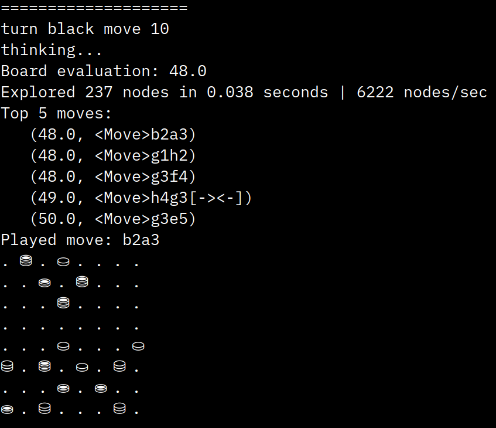

# Impasse Game Engine

This is a documentation of the game engine implementation of Impasse.
It has a pretty Unicode-based UI that run on terminal. After choosing
the preferred game mode, the game starts and the player is asked to
enter the move index, based on the list of legal moves.

*Author*: Foti Kerkeshi

*Github*: [https://github.com/f0ti/maastricht_AI/tree/master/isg/impasse](https://github.com/f0ti/maastricht_AI/tree/master/isg/impasse)

## Design

Color
-----
*color* is a boolean data type, either True for the White player or False for the Black player

Piece
-----
*PieceType*
  piece type is an integer data type, 1 for the single pieces,
  2 for the double (stacked) pieces

*PieceSymbols*, *PieceNames*
  since the engine is a console app, the peice symbols are represented
  by the "⛀", "⛁" and "⛂", "⛃" UNICODE characters respectively for the
  black and white and black pieces for each of the piece types
  
  (0 index of the list is skipped so to ease the element access using the
  PieceType (int) as indices)

Square
------
  square is an int data type for each of the 64 squares, indices order is
  from left to right, with the bottom left square as index 0 and top right
  square as index 63

  [Bitboard representation - ChessProgramming.org](https://www.chessprogramming.org/File:BBUniverse.jpg)

Bitboard
--------
  one bitboard is an int 64-bit data type, in binary it represents in ones
  and zeros the occupied and free squares in the board (piece centric)
  there are needed only 4 bitboards (integers) to keep the state of the
  board at any time

  - the black squares bitboard
  - the white squares bitboard
  - the single squares bitboard
  - the double squares bitboard
  
  bitwise conjuction (AND) of the above represents the board state

  [+] *Advantages*

  - very very fast move generation
  - memory efficient

  [-] *Challenges*
  
  - complicated moves need more thought and sometimes are hard to generate with bitwise operators

Piece
-----
  a piece consists of (piece_type, color)
  
  *Attributes*

  - *piece_type* is a constant from the PieceType enum
  - *color* is a boolean, True for white, False for black

  *Methods*

  - *symbol* method returns the unicode symbol of the piece
  "⛀", "⛁" and "⛂", "⛃"
  - the *__repr__* and *__str__* methods return the unicode symbol of the piece

Move
----
  a move consists of (from_square, to_square, transpose, bear_off, impasse, crown)

  *Attributes*

  - *from_square* and to_square are integers from 0 to 63
  - *transpose* is a boolean, True if the move is a transpose
  - *bear_off* is a boolean, True if the move is a bear off
  - *impasse* is a boolean, True if the move is an impasse
  - *crown* is an integer from 0 to 63, the square where the piece is crowned

  *Methods*

  - *__repr__* and *__str__* methods return the uci representation of the move
  - *uci* method returns the uci representation of the move
    e.g. "a1b1", "a1b1[-><-]", "a1b1[X][X]", "a1b1[-><-][X][X]"

BoardState
----------
  a board state consists of (singles, doubles, occupied_w, occupied_b, occupied, turn)
  
  *Attributes*
  
  - *singles* is a bitboard of the singles
  - *doubles* is a bitboard of the doubles
  - *occupied_w* is a bitboard of the white pieces
  - *occupied_b* is a bitboard of the black pieces
  - *occupied* is a bitboard of the occupied squares
  - *turn* is a boolean, True for white, False for black

  *Methods*

  - *restore* method restores the board state to a board, useful for storing the board state before making a move, and restoring it after

Board
-----
  a board consists of (move_stack, stack, turn, occupied_co, singles, doubles, occupied)

  *Attributes*
  
  - *move_stack* is a list of moves
  - *stack* is a list of board states
  - *turn* is a boolean, True for white, False for black
  - *occupied_co* is a list of bitboards of the white and black pieces
  - *singles* is a bitboard of the singles
  - *doubles* is a bitboard of the doubles
  - *occupied* is a bitboard of the occupied squares

  *Methods*

  - *legal_moves* property returns the legal moves as a list
  - *push* method makes a move on the board and pushes the board state to the stack
  - *pop* method pops the last move from the move stack and restores the board state
  - *board_state* method returns the board state as a BoardState object
  - *reset_board* method resets the board to the starting position
  - *piece_type_at* method returns the piece type at a square
  - *remove_piece_at* method removes a piece from a square
  - *set_piece_at* method sets a piece at a square
  - *piece_at* method returns the piece at a square
  - *get_backward_moves* method returns the backward moves for white doubles and black singles
  - *get_forward_moves* method returns the forward moves for white singles and black doubles
  - *generate_basic_moves* method generates the basic moves (forward, backward, transpose and crown)
  - *generate_impasse_moves* method generates the impasse moves
  - *generate_crown_moves* method generates the crown moves
  - *peek_for_crown* method peeks for a crown move
  - *crown_available* method returns True if a crown move is available
  - *perform_crown* method performs a crown move
  - *bearoff_available* method returns True if a bear off move is available
  - *transpose_available* method returns True if a transpose move is available
  - *generate_moves* method generates all the legal moves (basic and impasse)
  - *is_game_over* method returns True if the game is over
  - *side_removed_all_pieces* method returns True if a side has removed all their pieces
  - *print_board* method prints the board to the console, using the unicode pieces, . for empty squares

Valuator
--------

The valuator is used to evaluate the board state. It is used to determine
the best move for the AI to make. The valuator is based on the following
rules:

  - more single pieces in the furthest row for white, the better, and likewise
    more single pieces in the nearest  row for black, the better
  - more double pieces in the nearest  row for white, the better, and likewise
    more double pieces in the furthest row for black, the better
  - the more single pieces, the better
  - the less double pieces, the better

  - *top_highest* contains the value map for each square on the board for the pieces 
  that are valued more if they are in the furthest row
  - *top_nearest* contains the value map for each square on the board for the pieces
  that are valued more if they are in the nearest row
  - *single_value* is the value of a single piece
  - *double_value* is the value of a double piece
  - *impasse_value* is the value of an impasse move
  - *crown_value* is the value of a crown move
  - *transpose_value* is the value of a transpose move
  - *singles_disadvantage* is the difference in number of single pieces between the
  opponent and the current moving side
  - *doubles_disadvantage* is the difference in number of double pieces between the
  opponent and the current moving side
  - *singles_map_array* is the total value for each square on the board in accordance
  to the value map position of the piece
  - *doubles_map_array* is the total value for each square on the board in accordance
  to the value map position of the piece
  - *evaluate* is the total value of the board state

Game
----

Runs different *game modes* and AI search algorithm if needed

  - *selfplay*: plays against itself, moves can also be randomly chosen,
  otherwise the best move is chosen
  - *human_human*: plays against another human, by printing each move to the
  console with its index, and asking for the index of the move to be played
  - *human_AI*: plays against the AI, by printing each move to the console with
  its index, and asking for the index of the move to be played
  - *test_game*: debugging environment
  - *alphabeta_minimax*: runs the alphabeta minimax algorithm
  - *explore_leaves*: initializes AI search environment with configs and runs the
  minimax algorithm and returns the best moves

